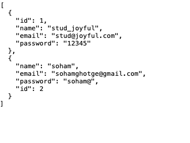
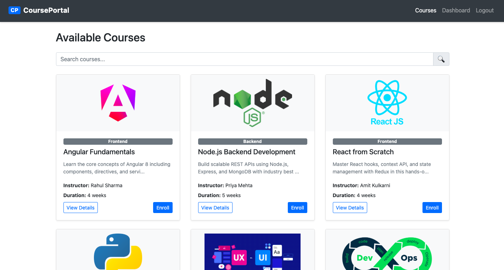
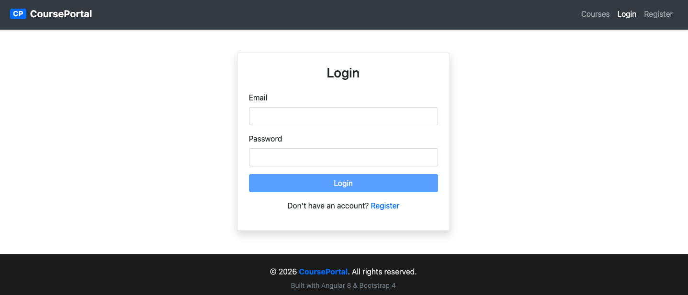
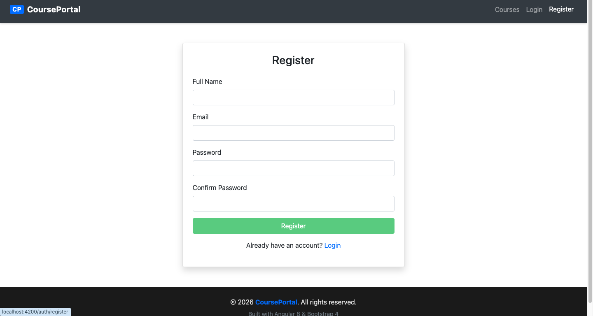

# Student Course Management Portal

A Single Page Application built with Angular 8, Bootstrap 4, and JSON Server as a mock REST API — developed as part of the joyful.bot Angular 8 Fresher Assignment.

## Tech Stack

- Angular 8 (TypeScript)
- Bootstrap 4.6
- JSON Server (mock REST API)
- RxJS

## Features

- Browse and search available courses
- Register and login with form validation
- Enroll and unenroll from courses
- Personal dashboard showing enrolled courses
- Protected routes using AuthGuard
- UnsavedChangesGuard on register form
- Custom TruncatePipe and HighlightDirective
- HTTP Interceptor for Authorization header
- Lazy loaded feature modules

## Project Structure

```
src/app/
├── core/            # Services, Guards, Interceptors, Models
├── shared/          # Reusable components, Pipes, Directives
├── auth/            # Login, Register (lazy loaded)
├── courses/         # Course List, Card, Detail (lazy loaded)
└── dashboard/       # User Dashboard (lazy loaded, protected)
```

## Setup Instructions

### Prerequisites
- Node.js v10.x or v12.x
- Angular CLI 8.x — `npm install -g @angular/cli@8`
- JSON Server — `npm install -g json-server`

### Run the project

```bash
# Clone the repo
git clone https://github.com/SohamGhotge/joyfulbot-angular8-SohamGhotge.git
cd joyfulbot-angular8-SohamGhotge

# Install dependencies
npm install

# Start JSON Server (in one terminal)
json-server --watch db.json --port 3000

# Start Angular app (in another terminal)
ng serve

# Open browser
http://localhost:4200
```

## Test Credentials

| Email | Password |
|-------|----------|
| stud@joyful.com | 12345 |

## Screenshots

### Navbar & Course List


### Auth



### Course Detail & Enroll


### Dashboard & Search




### 404 Page


## Author

Soham Ghotge — joyful.bot Angular 8 Assignment
